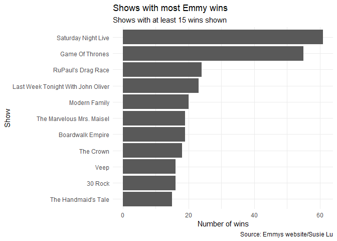
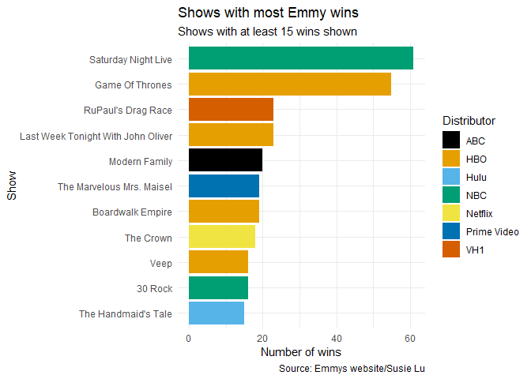
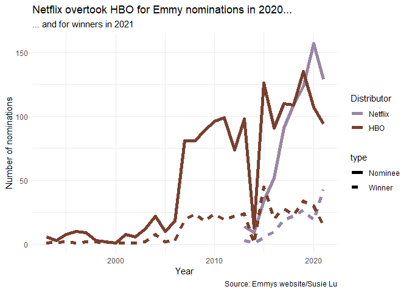
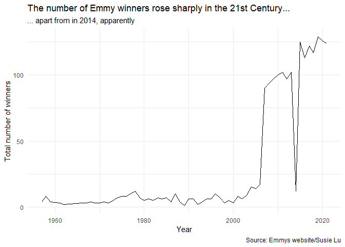

Code-along, Week 01: Emmy nominees
================
Alex Homer
23 September 2021

``` r
library(tidyverse)
library(wesanderson) #For colour scales later
```

*(Before running code chunks from this file, go to Session \> Set
Working Directory \> To Files Pane Location in RStudio.)*

*(Also, as you’ll see at the end, there’s a data collection error
happened with this dataset that affects all of the analysis below. You
have been warned!)*

## Read data

The data are [1] drawn from the “Tidy Tuesday” project: [2021 Week 39:
Emmy Awards and
Nominees](https://github.com/rfordatascience/tidytuesday/blob/master/data/2021/2021-09-21/readme.md)
(credit: [Emmys
website](https://www.emmys.com/awards/nominations/award-search)/[Susie
Lu](https://www.susielu.com/data-viz/emmy-2017)). They have been lightly
cleaned.

``` r
nominees_original <- readRDS("data/nominees_clean.rds")
```

*(Some of the code used in the subsequent sections is relatively
advanced! Don’t worry if you don’t understand what every line is doing.
We’ll be covering all of these by the end of the course.)*

## Cleanup

We need to do a little more clean-up first, because some shows are
multiple-listed when multiple people shared the same award.

``` r
nominees <- nominees_original %>%
  select(category, type, title, distributor, year, page, page_id) %>%
  distinct()
```

## Who won the most Emmys?

``` r
winners <- nominees %>%
  filter(type == "Winner") %>%
  select(-type)

(
  winners_count <- winners %>%
    count(title, sort = TRUE)
)
```

    ## # A tibble: 719 x 2
    ##    title                                  n
    ##    <chr>                              <int>
    ##  1 Saturday Night Live                   61
    ##  2 Game Of Thrones                       55
    ##  3 RuPaul's Drag Race                    24
    ##  4 Last Week Tonight With John Oliver    23
    ##  5 Modern Family                         20
    ##  6 Boardwalk Empire                      19
    ##  7 The Marvelous Mrs. Maisel             19
    ##  8 The Crown                             18
    ##  9 30 Rock                               16
    ## 10 Veep                                  16
    ## # ... with 709 more rows

*Saturday Night Live* won the most Emmys. Let’s see a graph!

``` r
#First make a new data frame with an "other" category.
cutoff <- 15

winners_count %>% filter(n >= cutoff) %>%
  mutate(title = fct_reorder(title, n)) %>%
  ggplot(aes(x = n, y = title)) +
  geom_col() +
  labs(
    x = "Number of wins",
    y = "Show",
    title = "Shows with most Emmy wins",
    subtitle = paste("Shows with at least", cutoff, "wins shown"),
    caption = "Source: Emmys website/Susie Lu"
  ) +
  theme_minimal()
```

<!-- -->

What if we wanted to see which distributor was responsible for each
winning show? We’ll need to go back to the original data, since we’ve
already “thrown away” that information in the `winners_count` data
frame.

``` r
cbbPalette <- c(
  "#000000", "#E69F00", "#56B4E9", "#009E73",
  "#F0E442", "#0072B2", "#D55E00", "#CC79A7"
)

winners %>% count(title, distributor) %>%
  filter(n >= cutoff) %>%
  mutate(title = fct_reorder(title, n)) %>%
  ggplot(aes(x = n, y = title, fill = distributor)) +
  geom_col() +
  labs(
    x = "Number of wins",
    y = "Show",
    fill = "Distributor",
    title = "Shows with most Emmy wins",
    subtitle = paste("Shows with at least", cutoff, "wins shown"),
    caption = "Source: Emmys website/Susie Lu"
  ) +
  scale_fill_manual(values = cbbPalette) +
  theme_minimal()
```

<!-- -->

The colour palette used is taken from [The R
Cookbook](http://www.cookbook-r.com/Graphs/Colors_(ggplot2)/#a-colorblind-friendly-palette)
and is colourblind-friendly.

## HBO v Netflix

HBO looks to have had quite a few of the most successful shows (in terms
of Emmy nominations, at least), but one of the stories people chose to
tell with these data on Tidy Tuesday was the rise of Netflix. Let’s see
if we can graph that.

``` r
hbo_netflix <- nominees %>%
  filter(distributor == "HBO" | distributor == "Netflix")

#We need to account for the fact that winners were also nominees
hbo_netflix_extra <- hbo_netflix %>%
  filter(type == "Winner") %>%
  mutate(type = "Nominee")

hbo_netflix_year <- hbo_netflix %>%
  bind_rows(hbo_netflix_extra) %>%
  count(distributor, type, year)

hbo_netflix_year %>%
  arrange(year) %>%
  mutate(distributor = fct_reorder(distributor, -n, last)) %>%
  ggplot(aes(x = year, y = n)) +
  geom_line(aes(colour = distributor, linetype = type), size = 2) +
  scale_colour_manual(values = wes_palette("IsleofDogs1")) +
  labs(
    x = "Year",
    y = "Number of nominations",
    colour = "Distributor",
    title = "Netflix overtook HBO for Emmy nominations in 2020...",
    subtitle = "... and for winners in 2021",
    caption = "Source: Emmys website/Susie Lu"
  ) +
  theme_minimal()
```

<!-- -->

Maybe the different line types are confusing… We could fix that by
faceting, but we’ll do that another time.

The `wes_palette` function used here is from the
[`wesanderson`](https://cran.r-project.org/web/packages/wesanderson/index.html)
package, and provides colourblind-friendly colour palettes inspired by
the films of [Wes Anderson](https://en.wikipedia.org/wiki/Wes_Anderson)
(who is known for “deliberately limited colour palette\[s\]” [2] in his
movies).

## What happened in 2014?

See the dip in 2014? Let’s investigate that.

``` r
winners %>% count(year) %>%
  ggplot(aes(x = year, y = n)) +
  geom_line() +
  labs(
    x = "Year",
    y = "Total number of winners",
    title = "The number of Emmy winners rose sharply in the 21st Century...",
    subtitle = "... apart from in 2014, apparently",
    caption = "Source: Emmys website/Susie Lu"
  ) +
  theme_minimal()
```

<!-- -->

Let’s investigate…

``` r
nominees_2014 <- nominees_original %>%
  filter(year == 2014)

nominees_2013 <- nominees_original %>%
  filter(year == 2013)

nominees_2014 %>% select(category) %>%
  distinct()
```

    ## # A tibble: 14 x 1
    ##    category                                                 
    ##    <chr>                                                    
    ##  1 Outstanding Lead Actress In A Drama Series               
    ##  2 Outstanding Lead Actor In A Drama Series                 
    ##  3 Outstanding Supporting Actress In A Drama Series         
    ##  4 Outstanding Supporting Actor In A Drama Series           
    ##  5 Outstanding Guest Actress In A Drama Series              
    ##  6 Outstanding Guest Actor In A Drama Series                
    ##  7 Outstanding Lead Actress In A Comedy Series              
    ##  8 Outstanding Lead Actor In A Comedy Series                
    ##  9 Outstanding Supporting Actress In A Comedy Series        
    ## 10 Outstanding Supporting Actor In A Comedy Series          
    ## 11 Outstanding Guest Actress In A Comedy Series             
    ## 12 Outstanding Guest Actor In A Comedy Series               
    ## 13 Outstanding Lead Actor In A Miniseries Or A Movie        
    ## 14 Outstanding Supporting Actress In A Miniseries Or A Movie

The 2014 dataset only appear to contain acting awards! Whereas for 2013,
if we look at awards without the words “Actor” or “Actress” in the
title.

``` r
nominees_2013 %>% select(category) %>%
  filter(!str_detect(category, "Actor")) %>%
  filter(!str_detect(category, "Actress")) %>%
  distinct()
```

    ## # A tibble: 81 x 1
    ##    category                                                           
    ##    <chr>                                                              
    ##  1 Outstanding Writing For A Drama Series                             
    ##  2 Outstanding Directing For A Drama Series                           
    ##  3 Outstanding Drama Series                                           
    ##  4 Outstanding Writing For A Comedy Series                            
    ##  5 Outstanding Directing For A Comedy Series                          
    ##  6 Outstanding Comedy Series                                          
    ##  7 Outstanding Writing For A Miniseries, Movie Or A Dramatic Special  
    ##  8 Outstanding Directing For A Miniseries, Movie Or A Dramatic Special
    ##  9 Outstanding Miniseries Or Movie                                    
    ## 10 Outstanding Choreography                                           
    ## # ... with 71 more rows

We see lots of different awards. This appears to be a data problem—it
looks like the 2014 awards haven’t been scraped properly from the
website.

``` r
nominees %>% filter(
  title == "Breaking Bad",
  category == "Outstanding Drama Series"
)
```

    ## # A tibble: 4 x 7
    ##   category                 type    title        distributor  year  page page_id
    ##   <chr>                    <chr>   <chr>        <chr>       <dbl> <dbl>   <dbl>
    ## 1 Outstanding Drama Series Winner  Breaking Bad AMC          2013   512       8
    ## 2 Outstanding Drama Series Nominee Breaking Bad AMC          2012   568      10
    ## 3 Outstanding Drama Series Nominee Breaking Bad AMC          2010   675       5
    ## 4 Outstanding Drama Series Nominee Breaking Bad AMC          2009   728       3

Yep, *Breaking Bad* [won this award in
2014](https://www.emmys.com/awards/nominations/award-search?search_api_views_fulltext=&field_is_winner=1&field_award_category%5B%5D=44541&field_celebrity_details_field_display_name=&field_show_details_field_nominee_show_nr_title=&field_nominations_year_op=%3E%3D&field_nominations_year%5Bvalue%5D=2014-01-01&field_nominations_year_1_op=%3C%3D&field_nominations_year_1%5Bvalue%5D=2014-01-01).
There’s been a data collection error, and of course that affects our
whole analysis!

*(This wasn’t building up to a deliberate conclusion—I realised these
things in the order presented here. Beware: this could happen to you! At
some point I will go back and re-scrape the data including the 2014
shows properly, and re-do the plots.)*

[1] People disagree on whether you should say “The data is” or “The data
are”. I’ve had it drummed into me that “data” is a plural word—singular
“datum” or “data point”—but you are free to disagree with me!

[2] Source:
[Wikipedia](https://en.wikipedia.org/wiki/Wes_Anderson#Visual_style)
